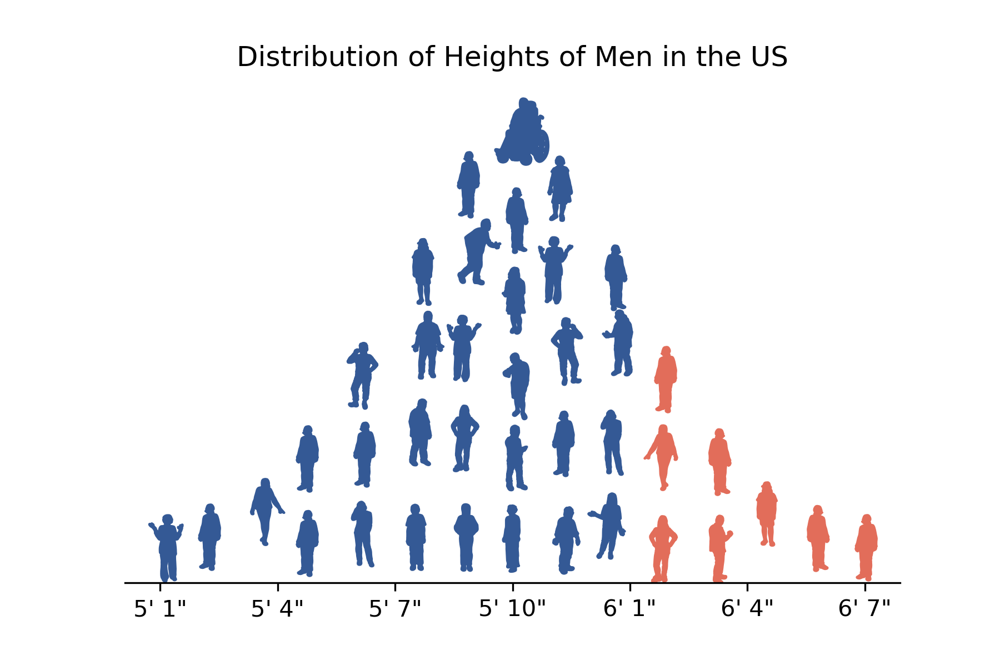

# Normal People

A demonstration of how to use the [Wee People](https://github.com/propublica/weepeople) font to make a plot of a
Normal distribution built out of people glyphs using Matplotlib in Python. 

Inspired by a [Tweet by Matthew Kay](https://twitter.com/mjskay/status/1519156106588790786) on doing the same thing (much more easily!) 
with ggplot2 in R.

The final result for my choice of parameters is also included in this repository:

This image is now the main image for the landing page of my book: [Foundations of Data Science with Python](https://jmshea.github.io/Foundations-of-Data-Science-with-Python/intro.html)
 
